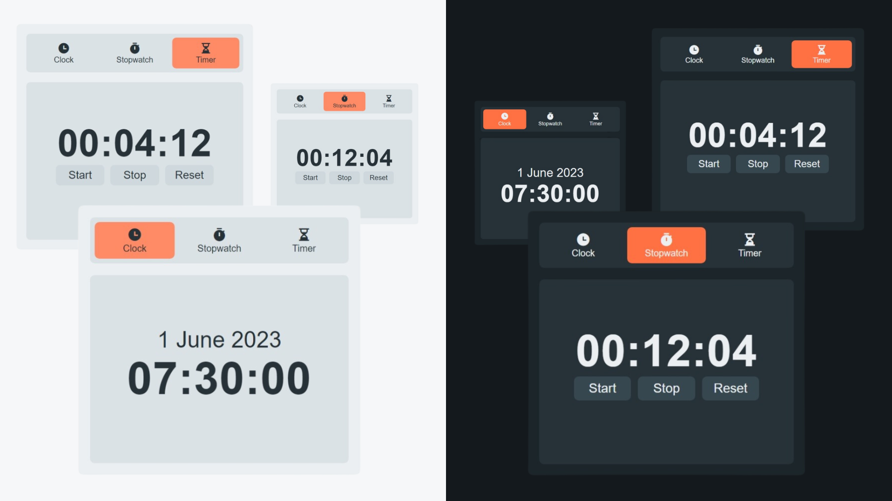

# Clock / Stopwatch / Timer (HTML,CSS,JavaScript)

This Weather App has been developed using HTML, CSS, and Vanilla JavaScript.

## Features
- Clock (Show curent date and time.)
- Stopwatch (Start, stop, and reset to measure elapsed time.)
- Timer (Counts down from a specified duration and alerts when the time has elapsed.)
- Switch the theme from light to dark (or dark to light).

## Preview

## Credit
Icon: [Remix Icon](https://remixicon.com/)

